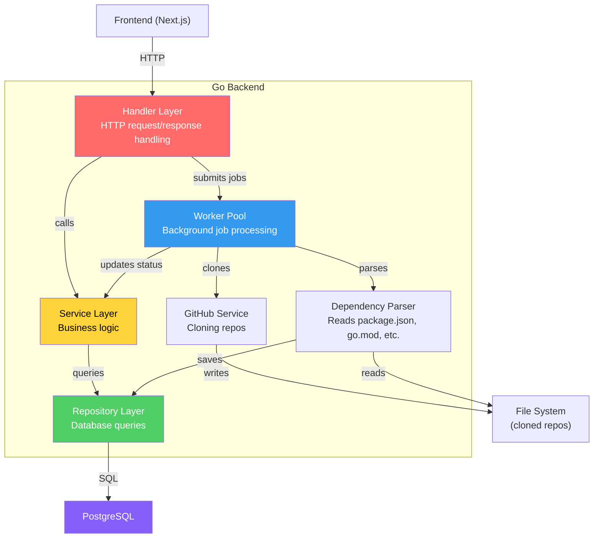
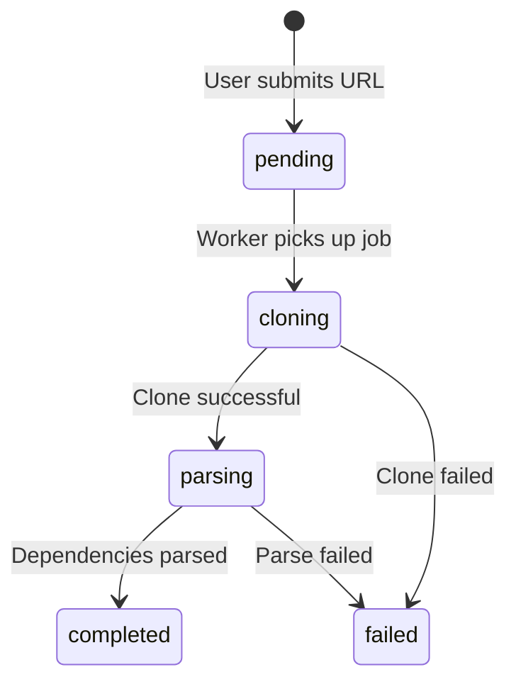
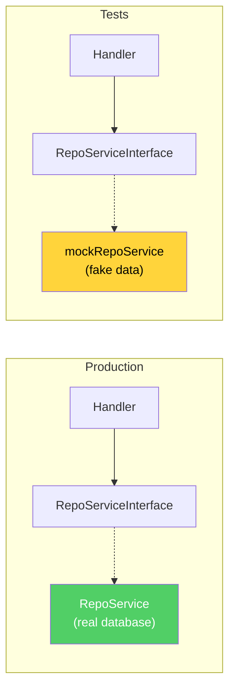
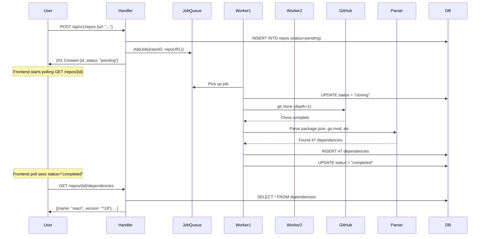
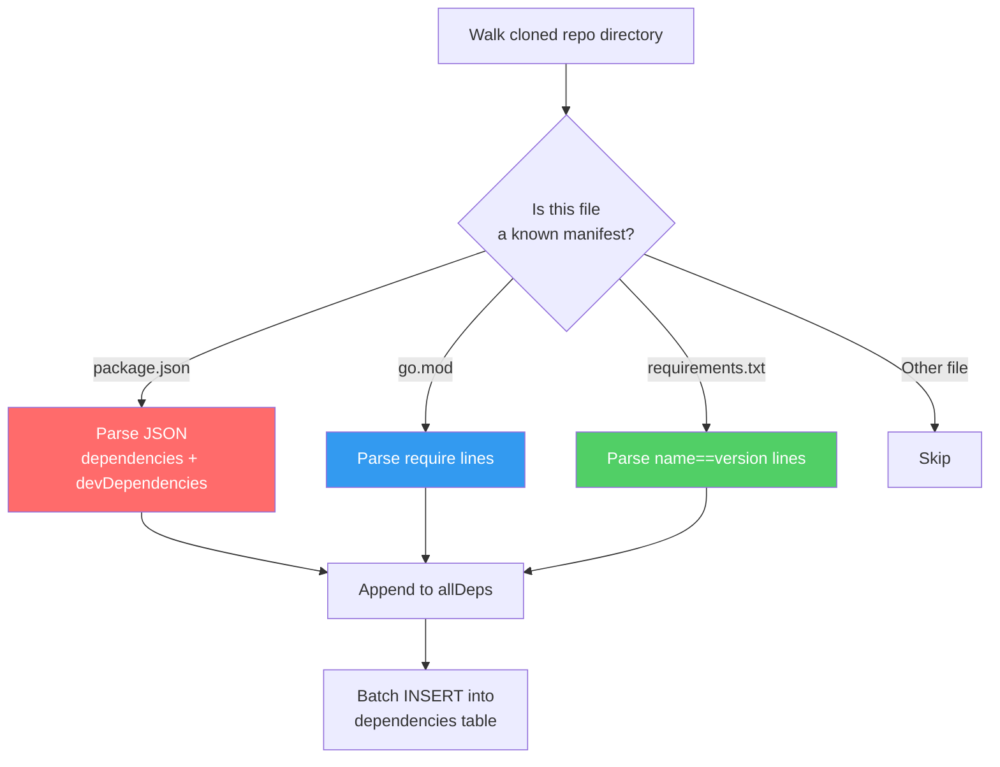
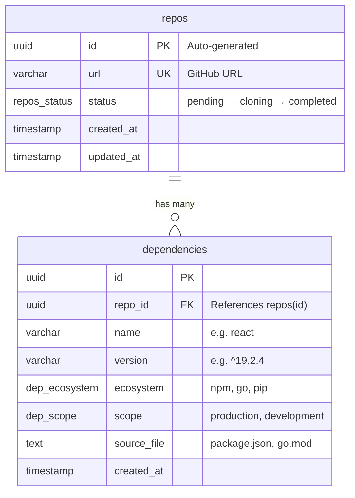

# Repo Analyzer: Backend Architecture

A deep dive into the Go backend — how it's structured, why each layer exists, how data flows through the system, and how the codebase evolved commit by commit.

---

## Table of Contents

1. [High-Level Architecture](#1-high-level-architecture)
2. [The Layered Pattern](#2-the-layered-pattern)
3. [Layer 1: Models](#3-layer-1-models)
4. [Layer 2: Repository](#4-layer-2-repository)
5. [Layer 3: Service](#5-layer-3-service)
6. [Layer 4: Handler](#6-layer-4-handler)
7. [Layer 5: Server & Router](#7-layer-5-server--router)
8. [The Worker Pool](#8-the-worker-pool)
9. [The Dependency Parser](#9-the-dependency-parser)
10. [Database Schema](#10-database-schema)
11. [The Full Request Lifecycle](#11-the-full-request-lifecycle)
12. [How The Codebase Evolved](#12-how-the-codebase-evolved)

---

## 1. High-Level Architecture

The backend follows a **clean architecture** pattern where each layer only knows about the layer directly below it. No layer reaches across to touch something it shouldn't.



---

## 2. The Layered Pattern

### Why layers?

Imagine you wrote all your code in `main.go` — SQL queries, HTTP handling, business logic, everything in one file. It would work, but:
- **Testing** becomes impossible (you can't test business logic without a real database).
- **Changing the database** means rewriting HTTP handlers.
- **Adding a new endpoint** risks breaking existing SQL queries.

The layered pattern solves this by separating concerns. Each layer has one job:

| Layer | Job | Knows About |
|-------|-----|-------------|
| **Handler** | Parse HTTP requests, return HTTP responses | Service interface |
| **Service** | Business logic, orchestration | Repository |
| **Repository** | Raw SQL queries | Database |
| **Models** | Data structures | Nothing (it's the foundation) |

### The Dependency Rule

The most important rule: **dependencies point inward**. The Handler knows about the Service, but the Service has NO idea the Handler exists. The Service knows about the Repository, but the Repository doesn't know what a Service is.


This is why the Handler receives a `RepoServiceInterface` (an interface), NOT a `*RepoService` (a concrete struct). During tests, you can swap in a mock service without touching the handler code.

---

## 3. Layer 1: Models

**Location**: `pkg/models/`

Models are plain Go structs that represent your data. They have zero logic and zero dependencies. They're in `pkg/` (not `internal/`) because they're safe to share across packages.

```go
// The core entity — a repository being analyzed
type Repo struct {
    ID        string    `json:"id"`
    URL       string    `json:"url"`
    Status    string    `json:"status"`       // pending → cloning → parsing → completed/failed
    CreatedAt time.Time `json:"created_at"`
    UpdatedAt time.Time `json:"updated_at"`
}

// A single dependency found in a repo
type Dependency struct {
    ID         string              `json:"id"`
    RepoID     string              `json:"repo_id"`
    Name       string              `json:"name"`        // e.g. "react"
    Version    string              `json:"version"`     // e.g. "^19.2.4"
    Ecosystem  DependencyEcosystem `json:"ecosystem"`   // npm, go, pip
    Scope      DependencyScope     `json:"scope"`       // production, development
    SourceFile string              `json:"source_file"` // package.json, go.mod
}

// A background job to process
type Job struct {
    RepoID  string
    RepoURL string
}
```

### The Status State Machine

A repo transitions through these statuses as the worker processes it:



---

## 4. Layer 2: Repository

**Location**: `internal/repository/`

The repository layer is the ONLY place in the entire codebase that touches SQL. If you ever switch from PostgreSQL to MySQL, you'd only change files in this folder.

### RepoRepository

Handles CRUD for the `repos` table:

```go
// Create — inserts a new repo and returns it with the generated UUID
func (r *RepoRepository) Create(ctx context.Context, url string) (*models.Repo, error) {
    query := `INSERT INTO repos (url) VALUES ($1)
              RETURNING id, url, status, created_at, updated_at`
    // Postgres generates the UUID and default status ("pending")
    err := r.db.QueryRow(ctx, query, url).Scan(...)
}

// FindByID — the frontend polls this every 2 seconds to check status
func (r *RepoRepository) FindByID(ctx context.Context, id string) (*models.Repo, error) { ... }

// UpdateStatus — the worker calls this as it progresses through stages
func (r *RepoRepository) UpdateStatus(ctx context.Context, id string, status string) error { ... }
```

### DependencyRepository

```go
// CreateBatch — inserts all parsed dependencies for a repo
// Uses ON CONFLICT DO NOTHING to handle duplicate dependencies gracefully
func (r *DependencyRepository) CreateBatch(ctx context.Context, deps []models.Dependency) error { ... }

// GetByRepoID — returns all dependencies for a repo, ordered by ecosystem then name
func (r *DependencyRepository) GetByRepoID(ctx context.Context, repoID string) ([]models.Dependency, error) { ... }
```

### Why `pgxpool.Pool`?

Every repository receives a `*pgxpool.Pool`, not a raw connection. A **connection pool** maintains a set of reusable database connections. Without it, every SQL query would open a new TCP connection to Postgres (slow), use it for one query, then close it (wasteful). The pool keeps connections alive and recycles them.

---

## 5. Layer 3: Service

**Location**: `internal/service/`

The service layer contains business logic. Right now the logic is thin (mostly pass-through), but this is where you'd add:
- URL validation (is this actually a GitHub URL?)
- Duplicate detection (has this repo already been analyzed?)
- Rate limiting

### The Interface Pattern

```go
type RepoServiceInterface interface {
    CreateRepo(ctx context.Context, url string) (*models.Repo, error)
    GetRepo(ctx context.Context, id string) (*models.Repo, error)
    UpdateRepoStatus(ctx context.Context, id string, status string) error
    GetRepoDependencies(ctx context.Context, id string) ([]models.Dependency, error)
}
```

**Why an interface?** The handler depends on this interface, NOT the concrete `RepoService` struct. In tests, you create a `mockRepoService` that implements the same interface but returns fake data. This means you can test your HTTP handler without a database, without Docker, without anything — just pure Go.



### GitHubService

Handles all GitHub interactions:
- **`ParseGitHubURL`**: Extracts `owner/repo` from URLs like `https://github.com/facebook/react`
- **`CloneRepo`**: Uses `go-git` to shallow clone (`depth: 1`) the repo to disk. Shallow clone only downloads the latest commit, making it much faster than a full clone.
- **`GetRepoMetadata`**: Fetches stars, description, etc. from the GitHub API (supports optional `GITHUB_TOKEN` for higher rate limits).

---

## 6. Layer 4: Handler

**Location**: `internal/handler/`

Handlers are the "glue" between HTTP and your business logic. Each handler method:
1. Parses the incoming HTTP request (URL params, JSON body)
2. Calls the service layer
3. Serializes the response as JSON

```go
func (h *RepoHandler) CreateRepo(w http.ResponseWriter, r *http.Request) {
    // 1. Parse the JSON body
    var req models.CreateRepoRequest
    json.NewDecoder(r.Body).Decode(&req)

    // 2. Call the service
    repo, err := h.repoService.CreateRepo(r.Context(), req.URL)

    // 3. Submit a background job to the worker pool
    h.workerPool.AddJob(models.Job{RepoID: repo.ID, RepoURL: repo.URL})

    // 4. Return the response immediately (don't wait for cloning)
    json.NewEncoder(w).Encode(resp)
}
```

**Key insight**: `CreateRepo` returns immediately after inserting the database row and submitting the job. The actual cloning and parsing happen asynchronously in the worker pool. This is why the frontend polls — it needs to keep checking until the background job finishes.

---

## 7. Layer 5: Server & Router

**Location**: `internal/server/`

The server wires everything together using the **Chi router** (a lightweight HTTP router for Go):

```go
func (s *Server) setupRoutes() {
    s.router.Get("/health",                          s.healthCheck)
    s.router.Post("/api/v1/repos",                   s.repoHandler.CreateRepo)
    s.router.Get("/api/v1/repos/{id}",               s.repoHandler.GetRepo)
    s.router.Get("/api/v1/repos/{id}/dependencies",  s.repoHandler.GetRepoDependencies)
}
```

The health check endpoint pings the database to verify the connection is alive — useful for Docker's `healthcheck` and load balancers.

---

## 8. The Worker Pool

**Location**: `internal/worker/`

This is the most interesting piece architecturally. When a user submits a repo, we can't block the HTTP response for 30+ seconds while we clone and parse it. So we use a **worker pool**.

### How It Works



### The Pool Pattern

The pool pre-spawns N goroutines (default: 4) that sit in an infinite loop, waiting for jobs:

```go
func (p *Pool) start() {
    for i := 0; i < p.workerCount; i++ {
        go func(workerId int) {
            for {
                select {
                case job := <-p.jobQueue:      // Wait for a job
                    p.repoProcessor.ProcessRepo(ctx, job.RepoID, job.RepoURL)
                case <-p.stopChan:             // Shutdown signal
                    return
                }
            }
        }(i)
    }
}
```

**Why a channel (`jobQueue`)?** Go channels are thread-safe queues. Multiple goroutines can safely read from the same channel — Go guarantees each job is delivered to exactly one worker. No mutexes, no race conditions.

**Why `stopChan`?** When the server shuts down, we close `stopChan`. All workers see this via the `select` statement and exit their loops. The `sync.WaitGroup` ensures we wait for in-progress jobs to finish before the program exits.

---

## 9. The Dependency Parser

**Location**: `internal/service/dependency_parser.go`

The parser walks the cloned repo's file tree, identifies dependency manifest files, and extracts all packages:



Each parser extracts the dependency name, version, ecosystem (npm/go/pip), and scope (production/development/optional). The scope matters because `devDependencies` in `package.json` are only needed during development, not in production.

---

## 10. Database Schema

The database has two core tables connected by a foreign key:



Key design decisions:
- **`ON DELETE CASCADE`**: When a repo is deleted, all its dependencies are automatically cleaned up.
- **`UNIQUE(repo_id, name, ecosystem, source_file)`**: Prevents duplicate dependencies if a repo is re-analyzed.
- **Enum types** (`repos_status`, `dep_ecosystem`, `dep_scope`): Postgres enforces valid values at the database level. You literally cannot insert `status = "banana"`.

---

## 11. The Full Request Lifecycle

Here's exactly what happens when a user enters `https://github.com/facebook/react` and clicks "Analyze":

```mermaid
graph TB
    A["1. Browser sends POST /api/v1/repos<br/>{url: 'https://github.com/facebook/react'}"]
    B["2. Next.js rewrite proxies to Go backend"]
    C["3. Handler.CreateRepo parses JSON body"]
    D["4. Service.CreateRepo calls Repository.Create"]
    E["5. Repository executes INSERT INTO repos<br/>Postgres generates UUID, sets status='pending'"]
    F["6. Handler pushes Job to worker pool channel"]
    G["7. Handler returns 201 {id: 'abc-123', status: 'pending'}"]
    H["8. Browser redirects to /analysis/abc-123<br/>Starts polling GET /api/v1/repos/abc-123 every 2s"]
    
    I["9. Worker goroutine picks up the job"]
    J["10. Worker updates status → 'cloning'"]
    K["11. Worker shallow-clones repo to /storage/repos/abc-123"]
    L["12. Worker walks file tree, finds package.json"]
    M["13. Parser extracts 47 dependencies"]
    N["14. Repository batch-inserts into dependencies table"]
    O["15. Worker updates status → 'completed'"]
    
    P["16. Frontend poll sees status='completed'"]
    Q["17. Frontend fetches GET /api/v1/repos/abc-123/dependencies"]
    R["18. Handler returns all 47 dependencies grouped by ecosystem"]

    A --> B --> C --> D --> E --> F --> G --> H
    H -.->|"Meanwhile, in background..."| I
    I --> J --> K --> L --> M --> N --> O
    O -.->|"Next poll..."| P --> Q --> R

    style A fill:#ff6b6b,color:#fff
    style G fill:#ffd43b,color:#000
    style O fill:#51cf66,color:#fff
    style R fill:#339af0,color:#fff
```



---

## 12. How The Codebase Evolved

Reading the git history tells the story of how this backend was built layer by layer:

### Phase 1: Foundation
| Commit | What Changed | Why |
|--------|-------------|-----|
| `d0c67f6` Initialize Go module | Created `go.mod` and a basic `main.go` | Every Go project starts with `go mod init` |
| `da94fed` Add Chi router | Added the HTTP router with a `/health` endpoint | You need a router before you can handle any requests |
| `2829606` Add server wrapper | Created `server.go` with `pgxpool` | Wrapped the router + DB connection into a reusable Server struct |

### Phase 2: CRUD API
| Commit | What Changed | Why |
|--------|-------------|-----|
| `c5d83ea` Add service layer | Created `service/repo.go` | Separated business logic from HTTP handling |
| `5ff2cea` Add repository tests | Wrote tests for the repository layer | Verify SQL queries work before building on top of them |
| `1a2005a` Add status constants | Defined `StatusPending`, `StatusCompleted`, etc. | Type-safe status strings prevent typos |
| `f07dfda` Add FindByID/UpdateStatus | Repository methods for reading and updating repos | The frontend needs to poll status, workers need to update it |
| `a32526c` Add GET endpoint | Handler for `GET /api/v1/repos/:id` | Frontend needs to check the analysis status |

### Phase 3: Background Processing
| Commit | What Changed | Why |
|--------|-------------|-----|
| `bcad0b7` Add GitHub service | Created `github.go` with `CloneRepo` and URL parsing | Need to actually download repos from GitHub |
| `215002b` Add repo processor | Created `repo_processor.go` | Orchestrates the clone → parse → save pipeline |
| `e69cde3` Add worker pool | Created `pool.go` with goroutines and channels | Can't block HTTP responses while cloning — need async processing |
| `731933a` Refactor worker pool | Added `sync.WaitGroup` and `stopChan` | Graceful shutdown — wait for in-progress jobs before exiting |
| `6280ce1` Fix double channel close | Added `select` guard on `Shutdown()` | Closing an already-closed channel panics in Go — this prevented a crash |

### Phase 4: Dependency Parsing
| Commit | What Changed | Why |
|--------|-------------|-----|
| `cd55f0c` Add Dependency model | Created `models/dependency.go` with ecosystem/scope enums | Need data structures before writing parsers |
| `87f8129` Add DB queries | Created `repository/dependency.go` with `CreateBatch` and `GetByRepoID` | Need to persist parsed dependencies |
| `91ec236` Add dependency parser | Created `dependency_parser.go` with npm/go/pip parsers | The core feature — reading manifest files |
| `447310f` Add dependencies endpoint | `GET /api/v1/repos/:id/dependencies` | Frontend needs to fetch and display the results |
