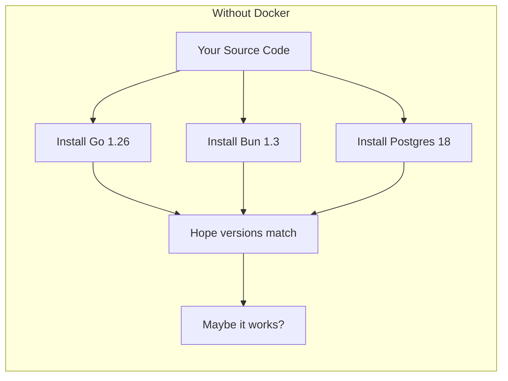
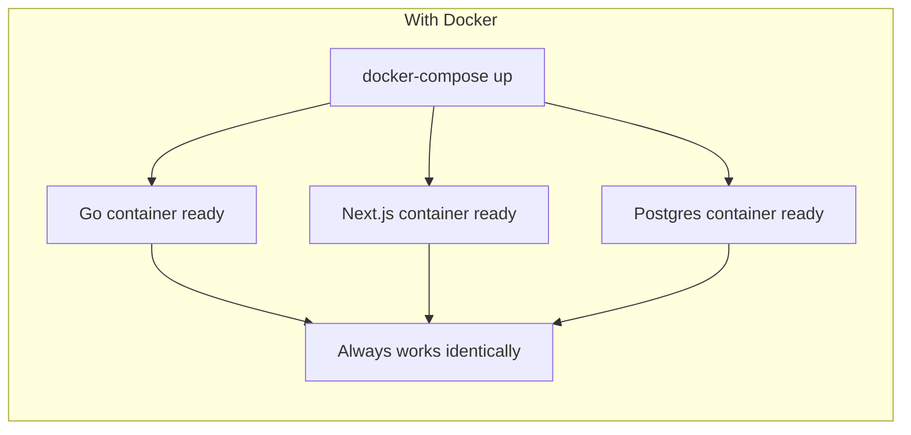
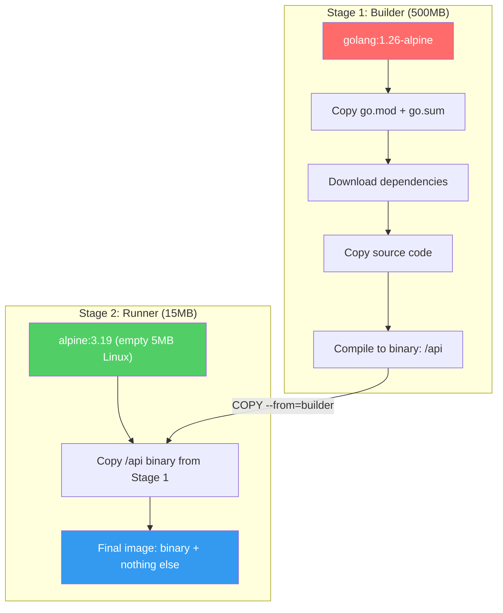
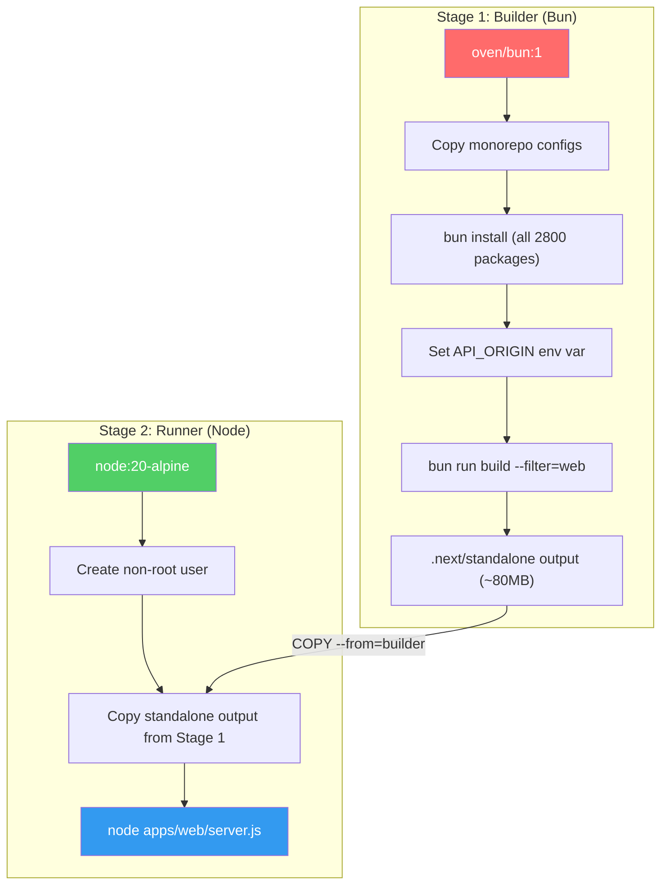
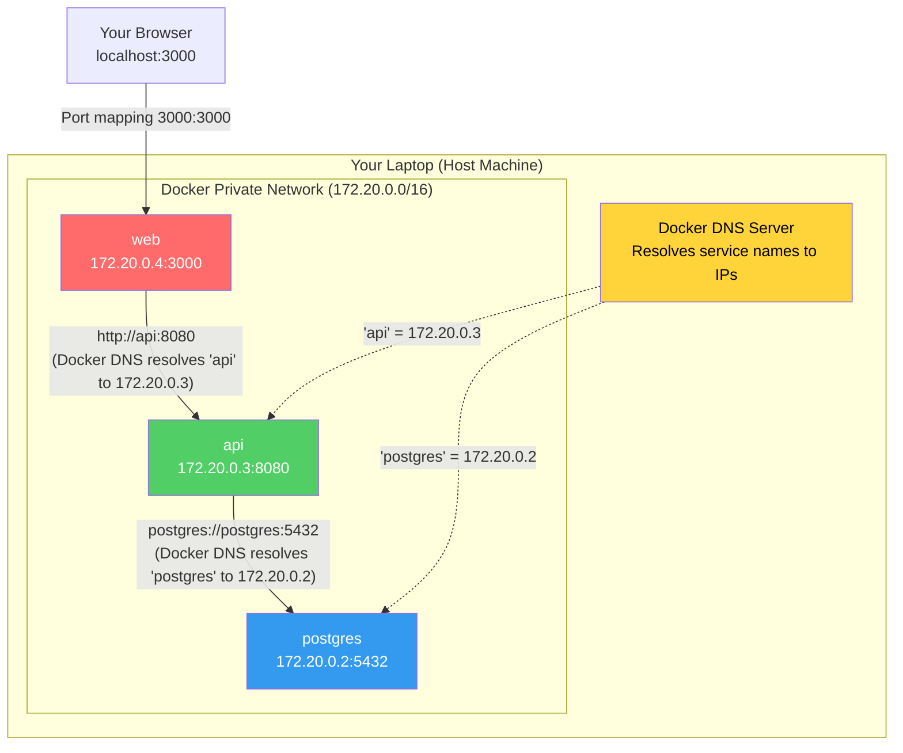
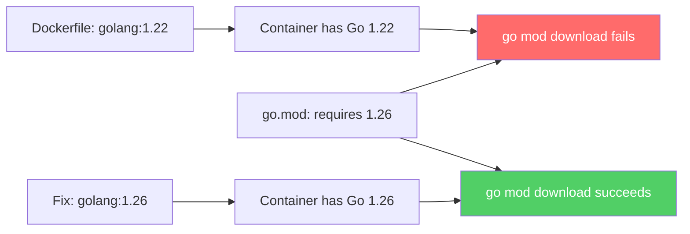
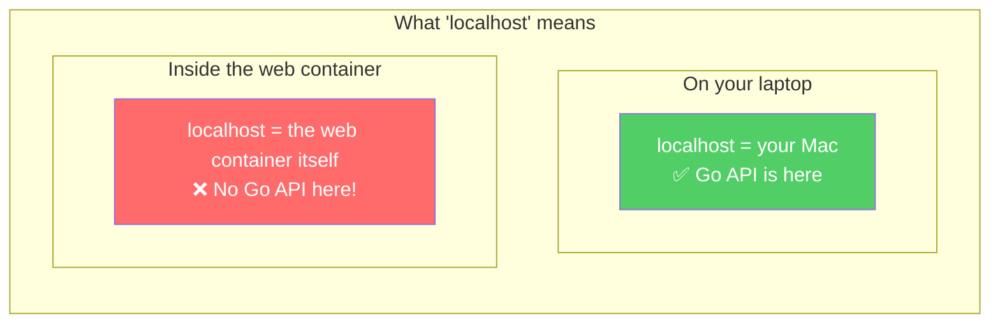
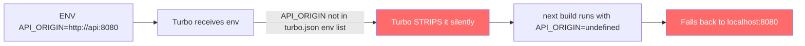
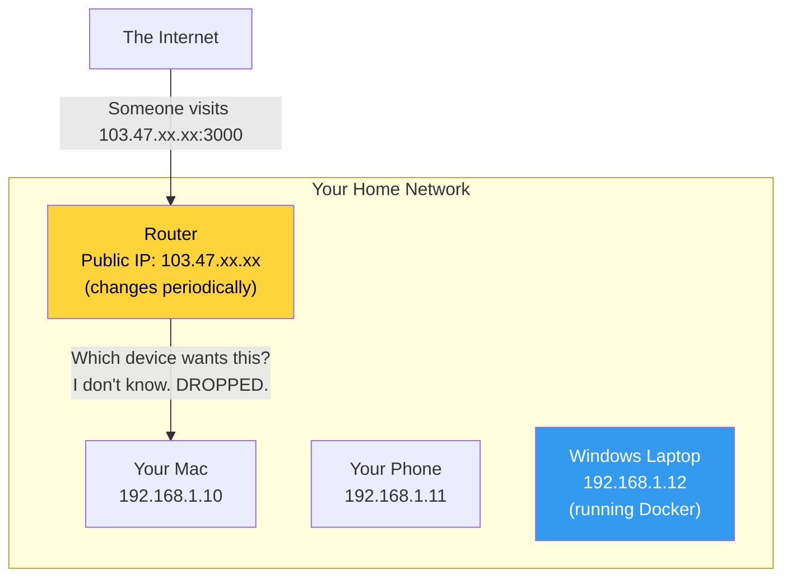
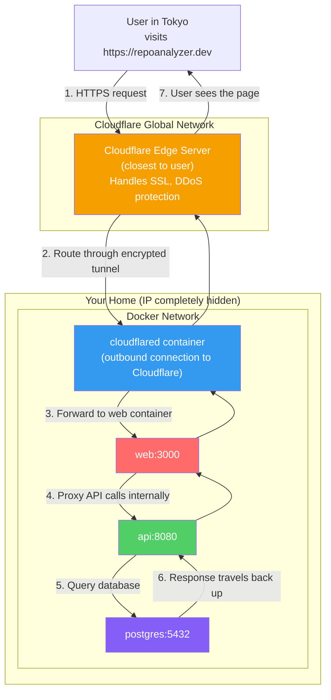

# Repo Analyzer: Infrastructure Deep Dive

A comprehensive guide explaining every infrastructure decision, the bugs we encountered, and how self-hosting works.

---

## Table of Contents

1. [Why Docker?](#1-why-docker)
2. [Multi-Stage Dockerfiles](#2-multi-stage-dockerfiles)
3. [Docker Compose & Networking](#3-docker-compose--networking)
4. [Bugs We Hit & Why](#4-bugs-we-hit--why)
5. [Security Hardening](#5-security-hardening)
6. [Self-Hosting with Cloudflare Tunnels](#6-self-hosting-with-cloudflare-tunnels)

---

## 1. Why Docker?

Your app has three pieces, each needing specific tools installed:

| Service | Requires |
|---------|----------|
| Frontend | Bun 1.3+, Node.js 20, ~2800 npm packages |
| Backend | Go 1.26 |
| Database | PostgreSQL 18 |

Without Docker, anyone who wants to run your app must install the exact right versions of Go, Bun, Node, and Postgres on their machine. If any version is slightly off, the app breaks.

**Docker solves this** by packaging each service along with its entire environment into a sealed box called a **container**. If it runs on your Mac, it runs identically on any Linux server, any Windows machine with WSL, or any cloud provider.





---

## 2. Multi-Stage Dockerfiles

Both our Dockerfiles use a technique called **multi-stage builds**. This is the single most important Docker optimization pattern.

### The Concept

Imagine you're shipping a book to someone:
- **Naive approach**: Ship the entire printing press along with the book (500kg).
- **Smart approach**: Use the printing press to print the book, then ship ONLY the book (1kg).

That's exactly what multi-stage builds do.

### Go Backend Example



- **Stage 1** has the entire Go compiler (500MB). It compiles your code into one binary.
- **Stage 2** starts fresh with a 5MB Alpine Linux. It copies ONLY the binary. The Go compiler is thrown away.
- **Result**: 15MB image with zero attack surface.

### Next.js Frontend Example



The key here is `output: "standalone"` in `next.config.ts`. Normally Next.js needs the entire `node_modules` (~800MB) to run. Standalone mode traces your actual imports and bundles only what's needed (~80MB).

---

## 3. Docker Compose & Networking

### The Private Network

When you run `docker-compose up`, Docker creates an invisible, private network. Each container gets a hostname equal to its service name.



**Key insight**: Inside this network, containers don't use IP addresses. They use service names. When the Go backend connects to `postgres:5432`, Docker's built-in DNS server translates `postgres` to the database container's IP.

### Port Mapping

The `ports: "3000:3000"` directive in docker-compose punches a hole from your laptop into the container:

```
Your browser → localhost:3000 → [port mapping] → web container:3000
```

Without this mapping, the container is completely isolated. The Postgres container has NO port mapping in production, which means it's invisible to the outside world — only the `api` container can reach it.

---

## 4. Bugs We Hit & Why

### Bug 1: Go Version Mismatch

```
go.mod requires go >= 1.26.1 (running go 1.22.12)
```



**Lesson**: The Go version in your Dockerfile must match what your `go.mod` requires.

### Bug 2: Bun Lockfile Version

```
error: Unknown lockfile version
```

Your laptop runs Bun 1.3 which writes a newer `bun.lock` format. The Dockerfile used `oven/bun:1.1` which couldn't parse it. Fixed by using `oven/bun:1` (latest 1.x).

### Bug 3: localhost Inside Docker

```
Failed to proxy http://localhost:8080 — ECONNREFUSED
```

This was the trickiest bug. Here's why:



Inside the `web` container, `localhost` refers to the `web` container itself, NOT your laptop. Since there's no Go API running inside the web container, the connection is refused.

**Fix**: Changed `API_ORIGIN=http://localhost:8080` to `API_ORIGIN=http://api:8080`. Docker DNS resolves `api` to the correct container.

### Bug 4: Turbo Stripping Environment Variables

Even after fixing Bug 3, Next.js still used `localhost:8080`. This was the sneakiest bug:



**Why**: Turborepo has a security feature — it only passes env vars to build tasks if they're explicitly whitelisted in `turbo.json`. This prevents accidental cache invalidation. But it silently drops unlisted vars.

**Fix**: Added `"env": ["API_ORIGIN", "NEXT_PUBLIC_API_ORIGIN"]` to the build task in `turbo.json`.

### Bug 5: Docker Using Stale Cached Images

After fixing the Dockerfile, running `setup.sh` still used the broken old image.

**Why**: `docker-compose up -d` (without `--build`) reuses previously built images. It never saw our Dockerfile changes.

**Fix**: Changed to `docker-compose up --build -d`.

---

## 5. Security Hardening

### Credentials in Version Control

The original `docker-compose.yml` had:
```yaml
POSTGRES_PASSWORD: repo_pass  # Anyone on GitHub can see this!
```

**Fix**: Moved all secrets to `infra/docker/.env` (gitignored) and reference them with `${POSTGRES_PASSWORD}`. Added `.env.example` as a template.

### Database Port Exposure

The Postgres container had `ports: "5432:5432"`, exposing the database to your laptop (and potentially the internet). Since only the `api` container needs database access (over the private Docker network), this port mapping is unnecessary in production.

---

## 6. Self-Hosting with Cloudflare Tunnels

### The Home Networking Problem



Three obstacles prevent people from reaching your laptop:
1. **NAT**: Your laptop has a private IP. The router doesn't know which device to forward requests to.
2. **Dynamic IP**: Your ISP changes your public IP randomly.
3. **Security**: Port forwarding (the traditional fix) punches holes in your firewall.

### The Cloudflare Tunnel Solution



**How it works**: Instead of opening ports inbound, `cloudflared` creates an outbound connection from your laptop TO Cloudflare. Firewalls don't block outbound connections. Cloudflare then reverse-routes user traffic through that connection. Your home IP is never exposed.

### What You Need To Do

| Step | Action | Why |
|------|--------|-----|
| 1 | Buy a domain (~$10/yr) | Users need a human-readable address |
| 2 | Add domain to Cloudflare (free) | Cloudflare becomes your DNS provider |
| 3 | Create a tunnel in Cloudflare dashboard | Get a tunnel token |
| 4 | Add `TUNNEL_TOKEN` to `.env` | Authenticate the tunnel |
| 5 | Add `cloudflared` service to docker-compose | Run the tunnel client |
| 6 | `./scripts/setup.sh` | Everything boots up, app is live |

The tunnel service is just 5 lines of YAML:
```yaml
  tunnel:
    image: cloudflare/cloudflared:latest
    command: tunnel --no-autoupdate run --token ${TUNNEL_TOKEN}
    depends_on: [web, api]
    restart: unless-stopped
```

Cloudflare automatically provides free SSL certificates, DDoS protection, and a global CDN — all for $0.
